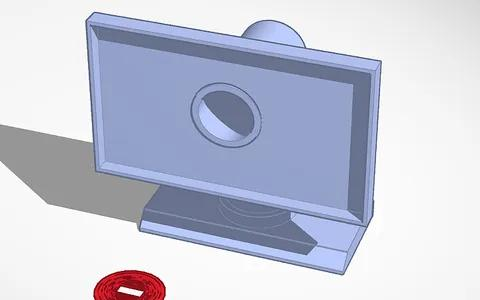
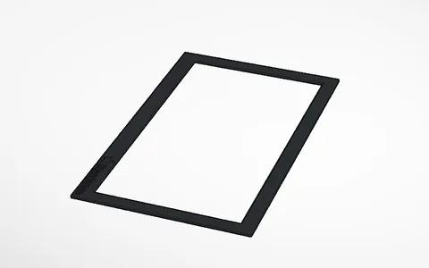
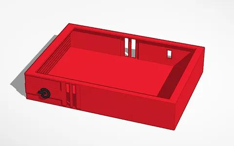
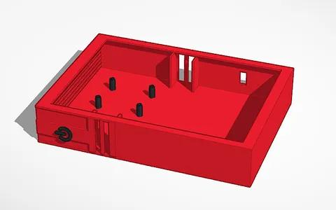
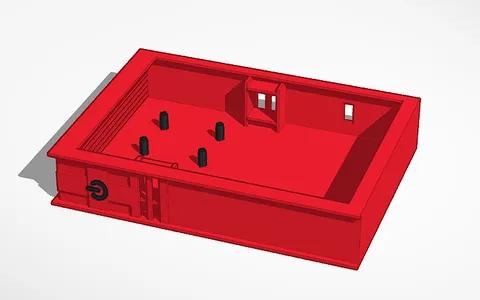
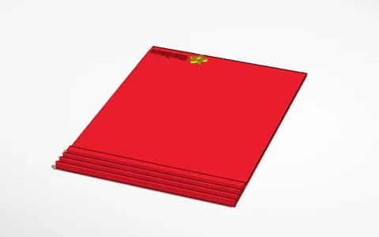

# PROGRESS

## Aug 27 
I started creating the 3d model for the pc casing and its cover in tinkercad.

## Aug28
I started creating the model for the display and its front panel as well as added holes in the main Pc's shell to fit a barrel jack and HDMI port. I had to get the measurements for the components online to make sure everything would fit but there are a few components that I couldn't find measurements for, I'll have to skip them for now.
~Monitor Front panel

## Aug 29
I added mount holes for the raspberry Pi and a space for the cooling fans as well as adding holes in the display to fit two speakers for audio

## Aug 30
I made the space for the cooling fans a tighter fit and added indents in the Pc's cover to fit magnets so the cover panel can be held magnetically. I also changed the design for the Pc a little and I slightly adjusted the Pc cover to be larger in accommodation.

