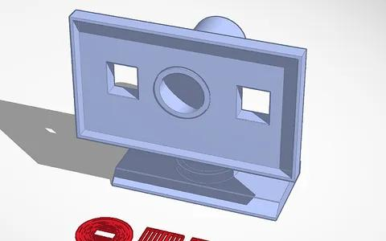

# RASPBERRY PI PC

Hello Stardance 👋 I've always wanted to build something like this, I'm really grateful that you gave me the chance to make it happen :D 

You see this is a custom sort of Pc powered by the RASPBERRY Pi 5. It's meant to run a version of Linux called Raspberry Pi OS, a debian-based Linux operating system designed for Raspberry Pi computers and it's what the entire Pc is built around.

The project itself isn't just a computer it's a whole custom desktop setup with a display. The display specifically is called the "DFROBOT 7'' HDMI Display with Capacitive Touchscreen" though I don't really plan on using the touch screen function :/ 

The Pc and Its Enclosure
-

The Pc will need many components to function properly. The raspberry pi will be mounted flat against the inner walls of casing and various cables and connectors will be plugged into it to allow it to communicate with other components. It will receive power from a 12v dc wall mounted adapter but before that it will pass through a buck converter that brings the voltage down to the recommended 5V

The pc case will feature various cavities in its lining to allow different ports to be positioned for input and output. It also has two ventilation holes the one Infront for intake and the one at the back for exhaust. Active coolers will be positioned there to allow a steady stream of cool air. This is especially important because the raspberry Pi can produce excessive heat during load and ventilation helps cool down the processor. The active coolers I chose though due to a lack of options operate at 24V while the power supply can only give 12V, so a dc-dc step up module is necessary for their function.

The Custom monitor
-

As I mentioned before the project will include a custom monitor featuring the DFROBOT 7-inch HDMI Display. It too will have a separate 3d printed enclosure/stand. It will be connected to the pc with an HDMI cable but becaus the screen does not feature speakers or any accommodation for audio I will also have to add a 3.5mm audio jack so that audio from the Raspberry Pi can be routed to the monitor enclosure and it will be connected to the Pc with a plain aux cable. The audio sent by the Pc will also have to pass through audio amplifiers to be able to drive the speakers

## 3D Printing

As much as I'd loved to, I don't have a 3d printer, so I have to get the parts 3d printed by a local company called Printheok. You can find more information about it in the components file

